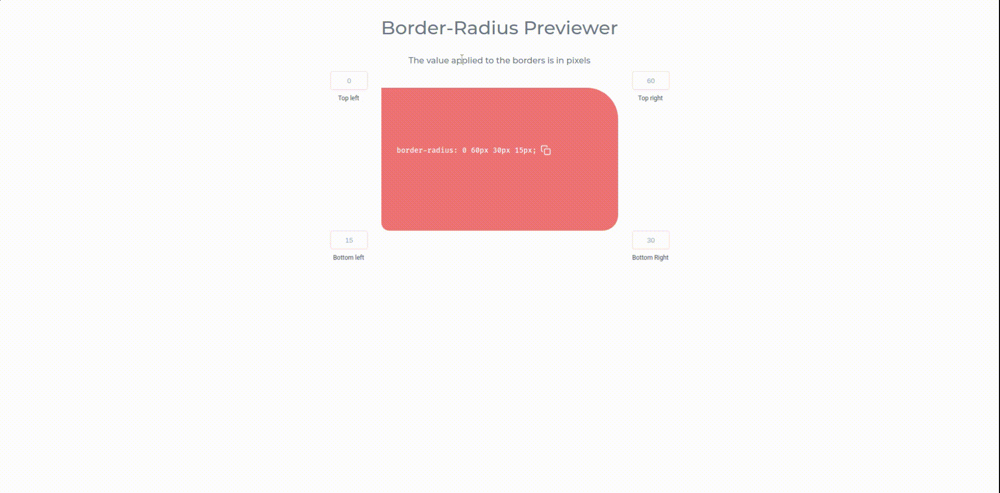
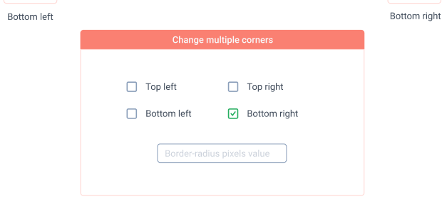

# Border-radius Previewer

## What is it?
This repo is a about a Border-radius Previewer. Apply the amount of pixels in
each corner of the box and see it getting rounder or sharper!

## Motivation of this project
I wanted to have have side projects to practice and challenge myself. But...
I didn't have any ideas... So I found this [App Ideas repo](https://github.com/florinpop17/app-ideas)
by [florinpop17](https://github.com/florinpop17) and gave it try.

The project you see here is the [Border-radius Previewer](https://github.com/florinpop17/app-ideas/blob/master/Projects/1-Beginner/Border-Radius-Previewer.md) (well, the name was kinda obvious 😅).

## What I did
For the first version, I decided to do the main features, as described in the following User Stories:

- [x] User can see a box which has a border-radius property applied to it
- [x] User can change the 4 border-radius values that are applied to the box (top-left, top-right, bottom-left, bottom-right)
- [x] User can copy the resulting CSS to the clipboard

## In  future version I intend to

- [ ] Add checkbox to change multiple border-radius:
  
- [ ] Change all 8 possible values of the border-radius in order to create a complex shape [as in this example](https://codepen.io/thebabydino/pen/zbqPVd)
- [ ] And refactor for a cleaner code.

## Give it a try!

You can use it by accessing the following [link](https://border-radius-previewer.vercel.app/)!